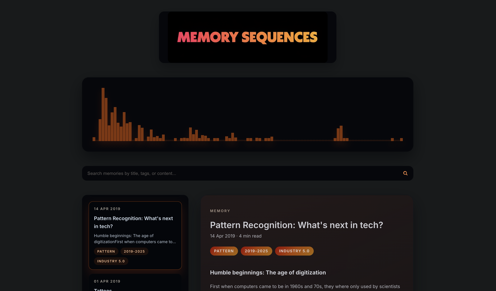

# Memory Sequence · Vue 3 rewrite

Memory Sequence is now a modern Vue 3 + Vite single-page experience that renders personal essays directly from `public/data.json`. The UI embraces a 2025-ready, minimalist dark aesthetic designed for focused reading on any device.



---

- [Key Features](#key-features)
- [Project Structure](#project-structure)
- [Getting Started](#getting-started)
- [Editing Content](#editing-content)
- [Styling & Theming](#styling--theming)
- [Build & Deploy](#build--deploy)
- [Next Steps](#next-steps)

---

## Key Features

- **Zero backend** — Static hosting friendly; all content comes from a JSON file in `public/`.
- **Modern dark UI** — Focused typography, responsive layout, and gentle motion.
- **Rich reading view** — Sanitised HTML rendering with tag chips and reading-time estimates.
- **Archive overview** — Quick stats (total entries, last update, tag count) plus interactive cards.

## Project Structure

```
memorySequence/
├── index.html           # HTML shell & metadata
├── public/
│   ├── data.json        # 🔸 single source of truth for entries
│   └── favicon.png
├── src/
│   ├── App.vue          # Shell layout, data loading, global state
│   ├── components/
│   │   ├── MemoryDetail.vue
│   │   └── MemoryList.vue
│   ├── assets/
│   │   ├── img/         # Preserved brand imagery
│   │   └── vue.svg
│   ├── main.js          # Entry point
│   └── style.css        # Global theme variables & resets
├── docs/                # Project notes (update as the Vue build evolves)
├── package.json
└── vite.config.js
```

## Getting Started

```bash
npm install
npm run dev
```

- Visit `http://localhost:5173/` (default Vite port).
- `npm run build` bundles the site for production into `dist/`.
- `npm run preview` serves the production build locally.

## Editing Content

All posts live inside `public/data.json`. Each entry should follow this structure:

```json
{
  "title": "Entry title",
  "content": "<p>HTML content…</p>",
  "time": "14 November 2025",
  "tags": ["personal", "theme"]
}
```

Changes in `public/data.json` are picked up immediately without rebuilding. Keep HTML simple (`<p>`, `<ul>`, `<a>`, `<strong>`, etc.); the reader sanitises content with DOMPurify before rendering.

## Styling & Theming

- Global tokens/typography live in `src/style.css`.
- Component-level polish is scoped within each `.vue` file.
- Assets from the original project (`src/assets/img/*`) remain available for future branding iterations.
- The layout uses CSS variables for rapid experimentation with hues, contrasts, and backgrounds.

## Build & Deploy

1. Generate a production build:
   ```bash
   npm run build
   ```
2. Deploy the `dist/` folder to any static host (Netlify, Vercel, S3, GitHub Pages, etc.).
3. Ensure `public/data.json` is included; editors can update the JSON in place to publish new entries instantly.

No server-side scraper or Angular dependencies remain — this is a purely static Vue front-end.

## Next Steps

- Layer in filters (by tag, year) or a fuzzy search when you’re ready.
- Extend the design system with additional components (timeline, gallery, etc.).
- Update the documents under `docs/` to reflect future enhancements to the Vue rebuild.

Enjoy crafting the new Memory Sequence experience!
